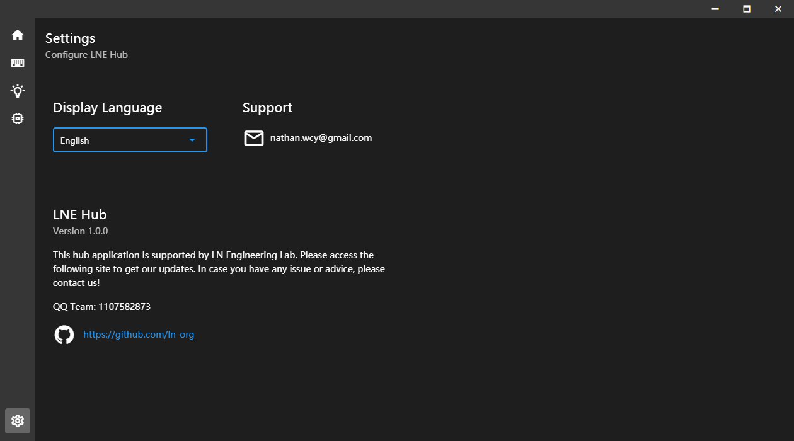
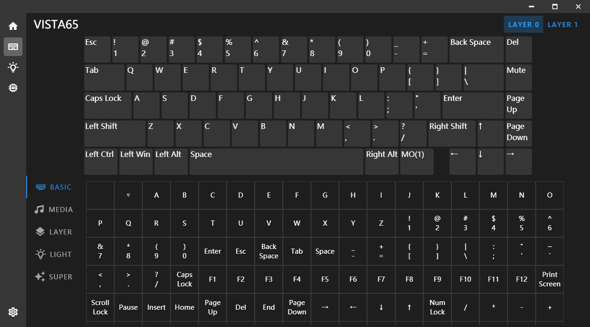

# LNE Hub
LNE Hub Presented by LN Engineering Lab

## Overview

The aim of this project is to help us work with LNE keyboard better.

### Supported Devices

* VISTA65 Dual-Mode
* MeowTool

### Getting Started

Please download [LNE Hub](https://github.com/ln-org/lne_hub/releases) for Windows. LNE Hub is updated monthly with new features and bug fixes.
If you are interested in this project, please contact us!

### Features
LNE Hub currently support the following features:
* Firmware Flashing
* Keyboard Keymap Configuring
* Backlight Control
* RGB Light Control
* Macro (Planned)
* Cloud Sync (Planned)

### Feedback
* [Create an issue](https://github.com/ln-org/lne_hub/issues) on GitHub
* [Gitee](https://gitee.com/lne-lab) https://gitee.com/lne-lab
* QQ Team 1107582873

## License
Copyright (c) LNE Lab. All rights reserved.
